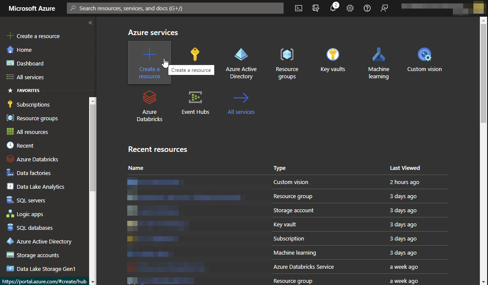
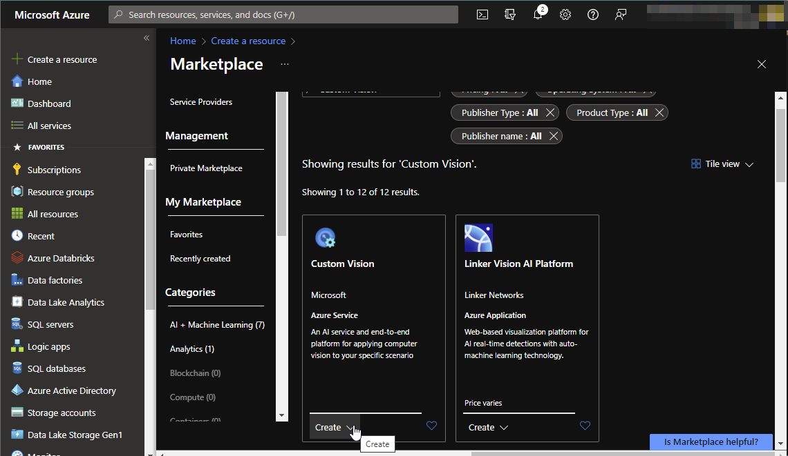
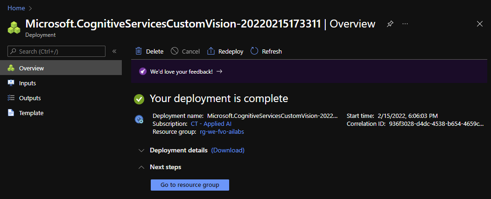

# Lab 1 - Classifying images using Azure Custom Vision

## Introduction

This lab covers classifying images. A classification algorithm is able to seperate objects into multiple categories. An algorithm could classify different kind of objects, like numbers, text or even sounds and images. Within this lab we will classify an image into one of three categories of fruit: an apple, orange or banana.

A Classification is a supervised learning problem. This means that we provide a training set with a label for each object. 

## Task 1 - Setting up the Custom Vision environment
Go to portal.azure.com and click on Create Resource.

 

 Type in the searchbox 'Custom Vision' and hit enter. 
 Select 'Custom Vision' and hit 'create'
 
 

Now you are able to configure the resource.
First of all you have to select a subscription and resource group. You can select a resource group you previously created, or create a new one.

For the region select 'West Europe'. For the name follow the naming convention. I named my custom vision 'dv-we-MY_OWN_INITIALS-ailabs'.

Select the Free pricing tiers.

Click Review + create, and if the validation was passed, click 'Create'.

 
 
  It will take a few minutes until the resource is created. After the resource has been created you can click on 'Go to resource group'

 

## Task 2 - Preparing the images
Download the files from github

## Task 3 - Creating the model in Custom Vision

## Task 4 - Testing the created model

## Task 5 - Deleting the resources

More information about custom vision can be found here:
https://azure.microsoft.com/en-us/services/cognitive-services/custom-vision-service/#overview