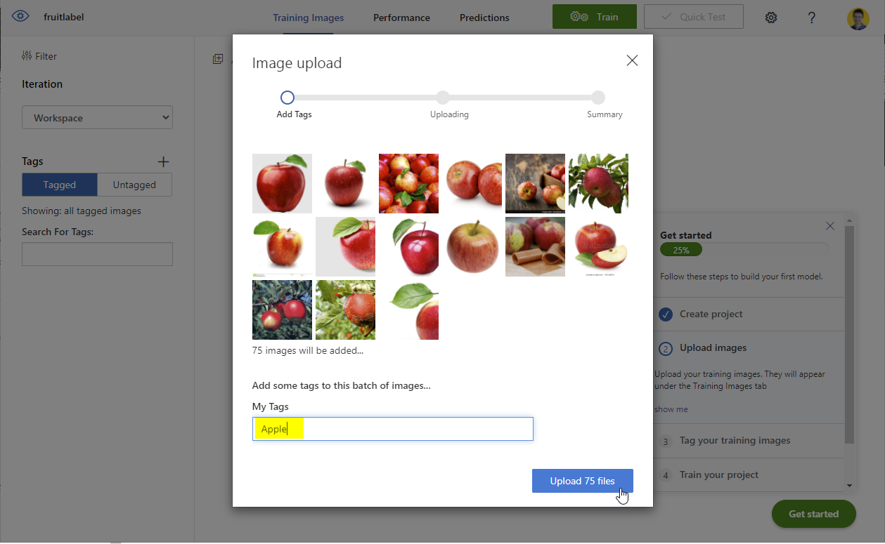

# Lab 1 - Classifying images using Azure Custom Vision

## Introduction

This lab covers classifying images. A classification algorithm is able to seperate objects into multiple categories. An algorithm could classify different kind of objects, like numbers, text or even sounds and images. Within this lab we will classify an image into one of three categories of fruit: an apple, orange or banana.

A Classification is a supervised learning problem. This means that we provide a training set with a label for each object. 

## Step 1 - Setting up the Custom Vision environment
Go to [portal.azure.com](https://portal.azure.com) and click on Create Resource.

 

 Type in the searchbox 'Custom Vision' and hit enter. 
 Select 'Custom Vision' and hit 'create'
 
 

Now you are able to configure the resource.
First of all you have to select a subscription and resource group. You can select a resource group you previously created, or create a new one.

For the region select 'West Europe'. For the name follow the naming convention. I named my custom vision 'dv-we-MY_OWN_INITIALS-ailabs'.

Select the Free pricing tiers.

Click Review + create, and if the validation was passed, click 'Create'.

 
 
  It will take a few minutes until the resource is created. After the resource has been created you can click on 'Go to resource group'

 

## Step 2 - Preparing the images
Download the files from [here](files/fruit-images-for-object-detection.zip) (click on the url and hit the download button) or the original [dataset on kaggle](https://www.kaggle.com/mbkinaci/fruit-images-for-object-detection)

Afterwards unzip the images to a location on your device.

## Step 3 - Creating the model in Custom Vision

 The custom vision resource should be created by now. You can click the link to the resource group from step 1. Afterwards click on the name in the resource. From here information is shown that can help you make use of this service. You can either use this service in multiple ways. One way is to use it within your python code in for example databricks or Azure Machine Learning. Another way is to use the portal of Custom Vision. Within this lab we will use the portal. You can access this portal by clicking on 'Custom Vision Portal' within the resource:
  
 
 
 You can also access it directly by going to the [customvision-portal](https://www.customvision.ai/)  and sign in.

 You will now have an overview of all the projects. There should be none currently. Within the free version you are only allowed to create two projects.

 Start your first project by selecting New Project. Give your project a name. Make sure Classification is selected and the custom vision resource you just created is displayed under 'Resource'. Select 'Multiclass' as classification type. Select 'Food' as Domain. 
 
 Custom Vision is pretrained on millions of images. This means that custom vision will use a model that is already trained and will train it further on the images provided by you. With relative low amount of your own training images and training effort it will be able to classify images into the categories that you have made. Custom Vision has multiple pre-trained domains. Food is an appropriate domain for our scenario.

After you select 'Create Project' your project will be loaded. Currently it is empty. Start to add images for three categories of fruit: Oranges, Bananas and Apples. Upload images to 

Navigate to where you have unzipped the folder in Step 2. Open the folder 'fruit-images-for-object-detection' > 'train_zip' > 'train' and select all the apples within the folder. Click on Open.

Give them the tag 'Apple' 

Do the same for the bananas and oranges, and tag them accordingly.

## Step 4 - Testing the created model

You can try out a few images yourself to see what custom vision thinks it sees in the image

## Step 5 - Deleting the resources
You can clean up the resources by going to the resource group in portal.azure.com, selecting the created resources and hitting delete.

More information about custom vision can be found here:

https://azure.microsoft.com/en-us/services/cognitive-services/custom-vision-service/#overview

https://docs.microsoft.com/en-us/azure/cognitive-services/Custom-Vision-Service/overview